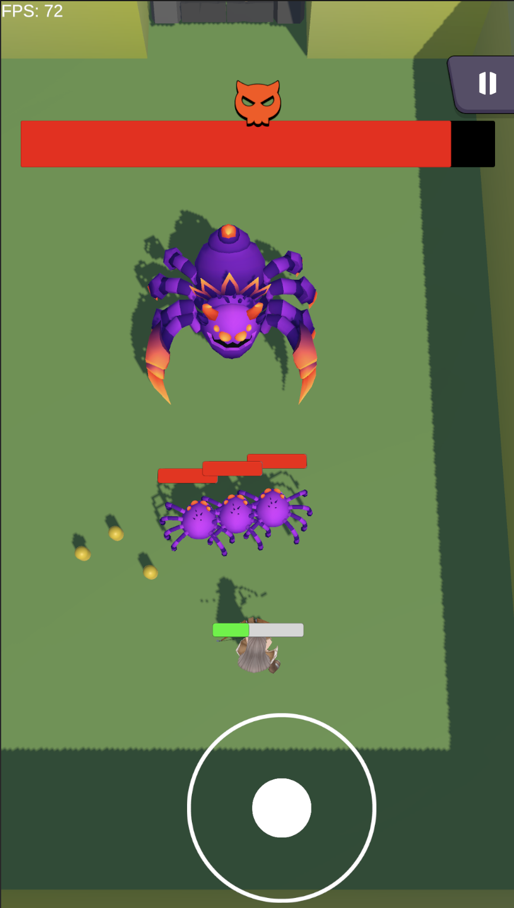

## 개인 게임 개발 프로젝트 [ArcherLegend]
### Archer Legend는 플레이어가 자동으로 공격하고, 
스테이지를 클리어하는 방식의 캐주얼 액션 게임입니다.
궁수의 전설을 참고하여 스테이지 기반 전투와 다양한 스킬 조합 시스템을 구현했습니다.

### 개요
* * *
- 프로젝트 이름:ArcherLegend
- 개발 기간:2025.01.21 – 2025.02.14  
- 개발 엔진, 언어: Unity & C#  

### 게임 설명
* * *

  

