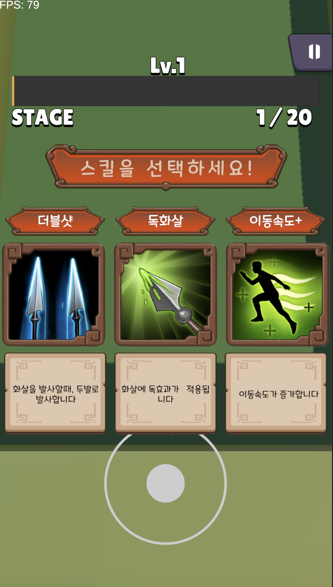

<h2 align="center">개인 게임 개발 프로젝트 [ArcherLegend]</h2>

  Archer Legend는 플레이어가 자동으로 공격하고,스테이지를 클리어하는 방식의 캐주얼 액션 게임입니다. 
  궁수의 전설을 참고하여 스테이지 기반 전투와 다양한 스킬 조합 시스템을 구현했습니다.

## 개요
- 프로젝트 이름:ArcherLegend
- 개발 기간:2025.01.21 – 2025.02.14  
- 개발 엔진, 언어: Unity & C#  

## 게임 설명
<table>
  <tr>
    <td align="center" width="33%">
       
      <b>시작 화면</b>
    </td>
    <td align="center" width="33%">
       
      <b>전투 화면</b>
    </td>
    <td align="center" width="33%">
       
      <b>스킬 선택 화면</b>
    </td>
  </tr>
</table>

### 스킬 기반 성장 시스템
전투 중 선택 가능한 다양한 스킬을 조합하여 매 스테이지마다 새로운 전투 스타일을 경험할 수 있습니다. 공격,보조,
속성 등 다양한 유형의 스킬을 조합해 전략적인 플레이가 가능합니다.

### 웨이브 전투와 보스 패턴 공략
스테이지는 적 웨이브와 보스로 구성되어 있으며, 보스는 고유 패턴을 통해 도전 욕구를 자극합니다. 이동과 회피를 
통해 패턴을 파악하고 공략하는 재미를 제공합니다.

### 자동 전투 + 캐주얼 컨트롤
플레이어는 자동으로 공격하며, 조작은 이동에만 집중할 수 있어 누구나 쉽게 접근 가능합니다. 간단한 조작 속에서도 
성장과 공략의 깊이를 느낄 수 있습니다.
## 콘텐츠

<table>
  <tr>
    <td align="center" width="33%">
       
      <b>다양한 적</b>
    </td>
    <td align="center" width="33%">
       
      <b>보스 전투</b>
    </td>
    <td align="center" width="33%">
       
      <b>다양한 스킬 시스템</b>
    </td>
  </tr>
</table>

